# Neural fluid simulator

A neural network that learns to simulate a fluid by watching simulations of it. It is never given the
equations: only examples of how a flow looks at one moment and a moment later. Left to run on its own
output, it produces the vortices shed behind an obstacle 52 times faster than the simulation it learned
from, keeps them going for as long as it is left running, and does so for obstacles and flow speeds it
never saw.

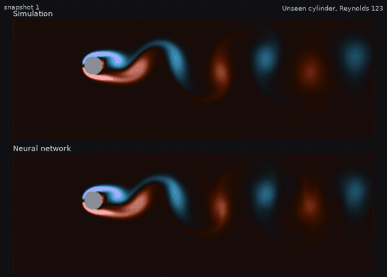

*Above, the real simulation. Below, the network, which receives only the first frame and predicts the
other 599 by itself. This cylinder was not in the training data. Colour is the spin of the fluid: blue
one way, red the other.*

Python · [PyTorch](https://pytorch.org) · CUDA. Trained in 1 hour 45 minutes on an RTX 3060.

**Status.** This is version 2. Version 1 was accurate for a while and then lost the flow; version 2
fixes that. What changed and what it cost is in [Version 1 and version 2](#version-1-and-version-2).
Version 1 is kept under the git tag `v1`.

## What it shows

| | |
| --- | --- |
| 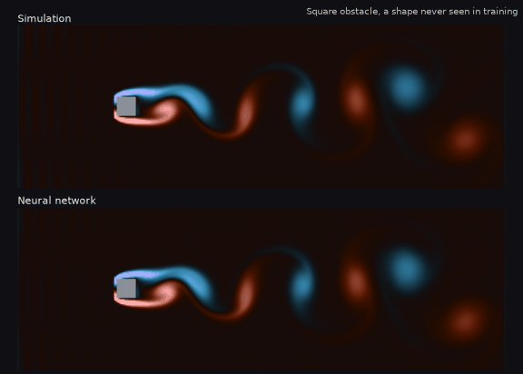 | **A shape it never saw.** Every training example is a cylinder. Given a square, the network still produces a wake that looks right, though it drifts out of step with the simulation sooner than for cylinders. |
| 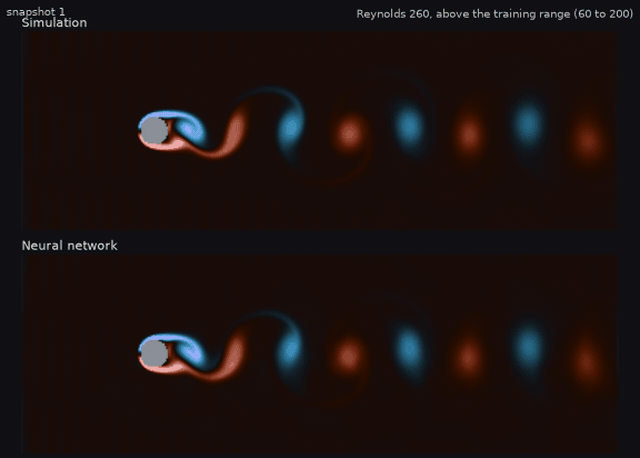 | **A faster flow than any in training.** The training flows have Reynolds numbers from 60 to 200. At 260 the network sheds vortices at the right rhythm, within 0.4 %. |

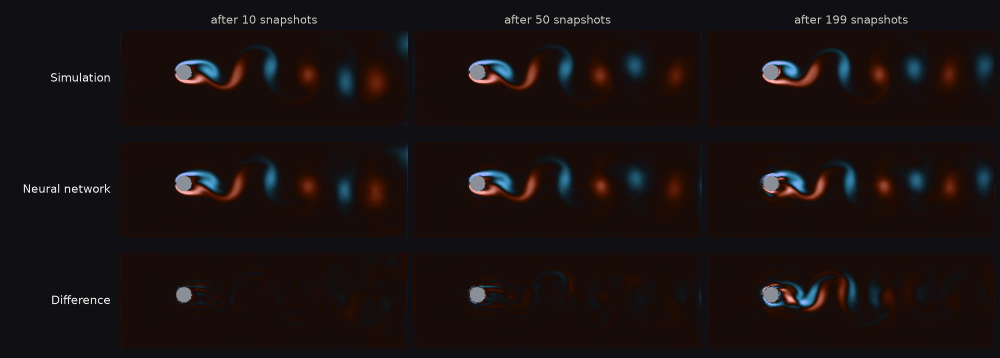

*The same unseen cylinder after 10, 50, 199 and 599 predicted snapshots. The wake keeps its shape
throughout; what grows is a small shift in time between the two, which is what the bottom row shows.*

## The method

**The simulation.** Two-dimensional flow past an obstacle, solved with the lattice Boltzmann method
(D2Q9 lattice, BGK collision) written in PyTorch so that it runs on the GPU. The fluid enters from the
left at constant speed, leaves freely on the right, and the top and bottom edges are joined. What
decides the character of the flow is the Reynolds number,

$$\mathrm{Re} = \frac{U D}{\nu}$$

with U the inflow speed, D the size of the obstacle and ν the viscosity. Between about 50 and 200 the
wake of a cylinder is a regular street of alternating vortices, the von Kármán vortex street.

**The data.** 60 simulations on a 768 × 256 grid, each saved as 600 snapshots of the velocity field,
100 simulation steps apart, at half resolution (384 × 128):

| Set | Simulations | Contents |
| --- | --- | --- |
| Training | 40 | Cylinders of random diameter and height, Reynolds 60 to 200 |
| Validation | 4 | The same kind; used to watch the training and choose the final network |
| Unseen cylinders | 4 | The same kind; used only for the results below |
| Reynolds sweep | 10 | One fixed cylinder at Reynolds 60, 80 … 200, and 230 and 260 |
| Square | 2 | A square obstacle at Reynolds 100 and 160 |

**The network.** A U-Net with 1.5 million parameters. Its input is the velocity field, the shape of
the obstacle and the Reynolds number; its output is the change of the velocity field over one snapshot.
Its convolutions are padded to match the simulation: joined at top and bottom, open at left and right.

**Training.** Five stages, 17 000 steps in total:

1. Predict the next snapshot.
2. Predict 4 snapshots in a row, feeding on its own output, with the error measured on all of them.
3. The same with 8 snapshots.
4. Keep a few predictions running for up to 1000 snapshots, advancing each one 4 snapshots per step
   from where it left off. Each is corrected against the moment of the real simulation that it most
   resembles, not the same moment by the clock.
5. The same, with a small constant learning rate, measuring the network every 250 steps on the
   validation flows and keeping the best one.

Stage 4 is what makes the network last. It gets to see the flows that it itself produces after hundreds
of snapshots alone, and learns to stay on a real flow from there. Comparing with the most similar
moment matters: after a long time alone the network is inevitably a little ahead or behind the
simulation, and penalising that would only teach it to blur the vortices away.

## Validation

**The simulator against experiment.** Behind a cylinder, vortices are shed at a steady rhythm. In
dimensionless form that rhythm is the Strouhal number, St = f D / U, measured many times in the
laboratory. `scripts/validate_strouhal.py` measures it in the simulator at Reynolds 100:

| Channel height | Simulator | Experiment, open flow | Difference |
| --- | --- | --- | --- |
| 12 diameters | 0.1752 | 0.164 | +6.8 % |
| 24 diameters | 0.1734 | 0.164 | +5.7 % |

The simulator sheds faster than a cylinder in open flow. Part of the reason is that its cylinder sits
in a channel of finite height, which squeezes the flow past it: with twice the room the difference
shrinks. That does not account for all of it; the rest is probably the coarse cylinder (30 cells
across), which has not been checked. The simulations in the dataset use a narrower channel still (6 to
9 diameters), so their Strouhal numbers are higher again. The network is therefore compared with the
simulator, not with open-flow experiments.

**The network against the simulator.** All the numbers below are for simulations the network never
saw, neither in training nor when choosing the final network, with the network running on its own from
the first snapshot (`scripts/evaluate.py`).

*Shedding rhythm.* The property an engineer would ask for:

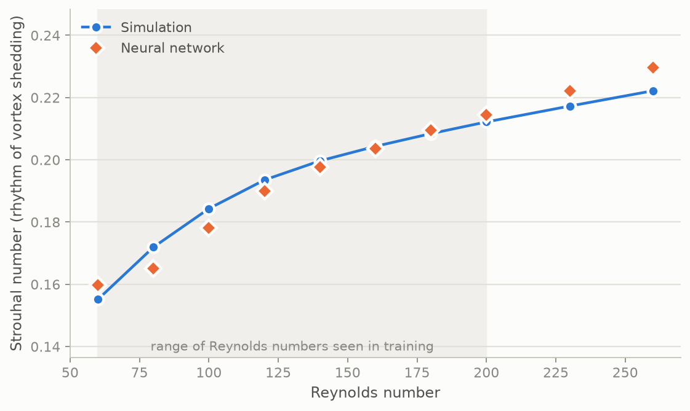

| Reynolds | 60 | 80 | 100 | 120 | 140 | 160 | 180 | 200 | 230 | 260 |
| --- | --- | --- | --- | --- | --- | --- | --- | --- | --- | --- |
| Simulator | 0.161 | 0.176 | 0.186 | 0.194 | 0.201 | 0.205 | 0.209 | 0.212 | 0.217 | 0.222 |
| Network | 0.167 | 0.176 | 0.185 | 0.193 | 0.199 | 0.205 | 0.209 | 0.212 | 0.217 | 0.221 |
| Difference | +3.9 % | −0.2 % | −0.4 % | −0.7 % | −0.8 % | −0.4 % | −0.2 % | 0.0 % | +0.1 % | −0.4 % |

The last two columns are outside the range of Reynolds numbers used in training.

*How long it lasts.* Left running for 2000 snapshots, more than three times the length of any training
example and between 45 and 62 shedding cycles, the network keeps a wake of the right strength in all
ten flows of the sweep.

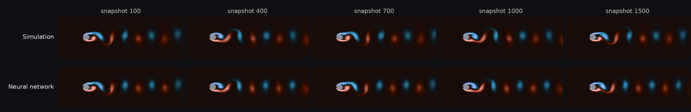

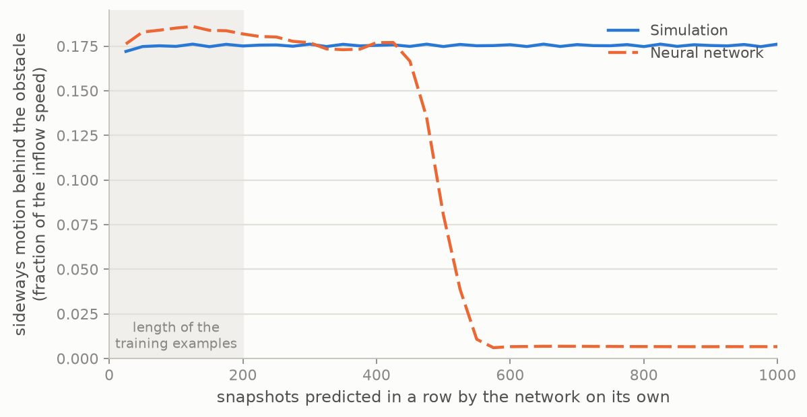

*Reynolds 160, a run of 1500 snapshots (`scripts/long_run.py`). The network's wake is steady, and about
3 % stronger than the simulator's.*

*Error snapshot by snapshot.* The distance between the predicted and the true velocity field, as a
percentage of the size of the flow pattern. It is measured in two ways. Compared at the same instant,
a correct wake that runs slightly ahead or behind counts as wrong:

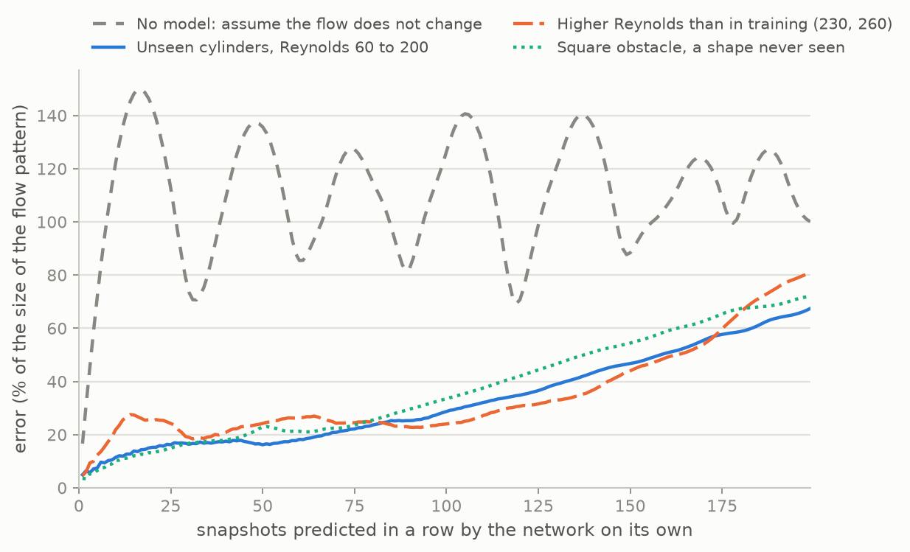

| Snapshots predicted in a row | 10 | 50 | 199 | 599 |
| --- | --- | --- | --- | --- |
| Unseen cylinders | 9 % | 10 % | 14 % | 34 % |
| Higher Reynolds (230, 260) | 15 % | 27 % | 44 % | 58 % |
| Square obstacle | 15 % | 23 % | 62 % | 91 % |
| No model, assuming the flow does not change | 128 % | 146 % | 103 % | 135 % |

Compared instead with whichever moment of the simulation each predicted frame most resembles, the
timing drops out and what is left is how far the prediction is from being a real flow at all:

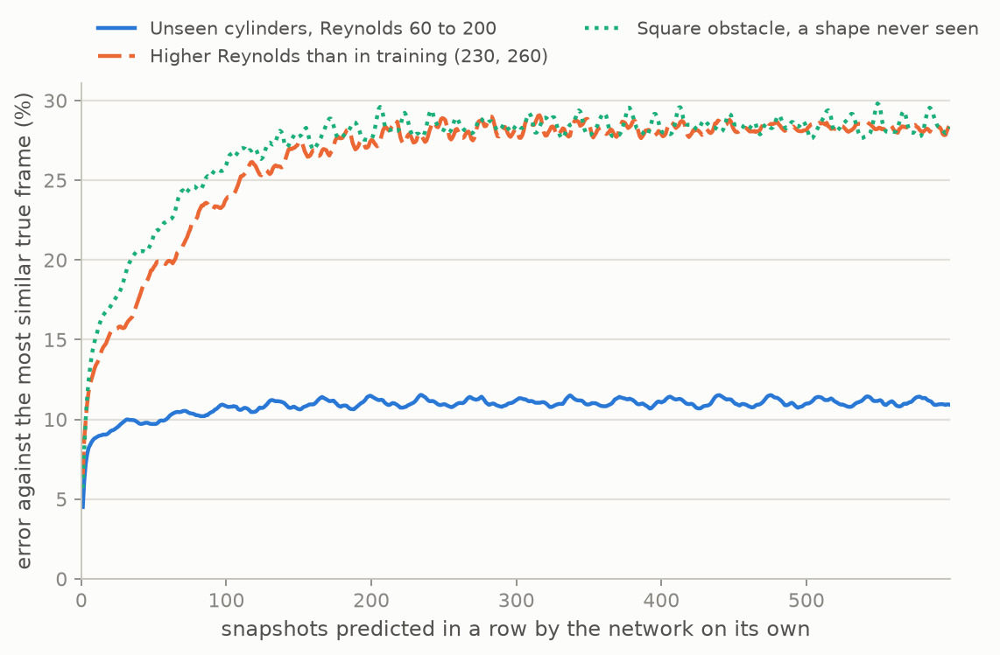

| Snapshots predicted in a row | 10 | 50 | 199 | 599 |
| --- | --- | --- | --- | --- |
| Unseen cylinders | 9 % | 10 % | 11 % | 11 % |
| Higher Reynolds (230, 260) | 13 % | 20 % | 27 % | 28 % |
| Square obstacle | 15 % | 22 % | 28 % | 28 % |

This second error rises at first and then stays flat: the network settles on a flow and remains on it.
The gap between the two tables is the part of the error that is only timing.

*Speed.* One snapshot takes the simulator 176 ms (100 steps on a 768 × 256 grid) and the network
3.4 ms, both on the same RTX 3060: 52 times faster. The comparison flatters the network somewhat,
because the simulator is plain PyTorch and not an optimised solver.

## Version 1 and version 2

Version 1 was trained on 28 simulations of 200 snapshots, with a last stage that let the network run
alone for at most 40 snapshots. It followed the simulation closely at first, but left running it lost
the wake:

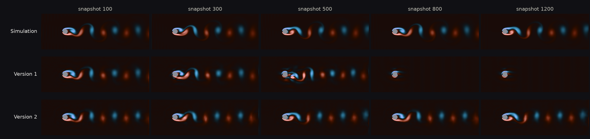

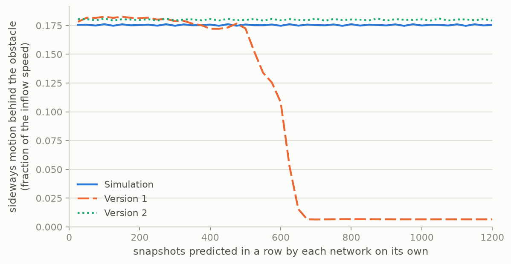

*Reynolds 160, both networks predicting on their own from the same first frame
(`scripts/compare_versions.py`). The vortices of version 1 break up between snapshots 500 and 650;
version 2 keeps them to the end.*

Version 2 changed three things: simulations three times longer and more of them (40 of 600 snapshots),
the running predictions of training stage 4, and choosing the final network on separate validation
flows. Both networks measured on the same test simulations of version 2:

| | Version 1 | Version 2 |
| --- | --- | --- |
| Flows of the sweep where the wake survives 2000 snapshots | 0 of 10 | 10 of 10 |
| How long the wake lasts | 300 to 1000 snapshots | at least 2000 |
| Error on unseen cylinders after 10 snapshots | 6 % | 9 % |
| … after 50 | 8 % | 10 % |
| … after 199 | 19 % | 14 % |
| … after 599 | 189 % | 34 % |
| Error on the square obstacle after 199 snapshots | 51 % | 62 % |
| Error at higher Reynolds after 50 snapshots | 16 % | 27 % |

Version 2 is not better at everything. Over the first 50 snapshots version 1 stays closer to the
simulation, and on the square and at higher Reynolds numbers it is also closer for a while. What
version 2 gains is that it does not fall apart, which is what makes a model of this kind usable. The
error figures of version 1 here are lower than those first published for it, because these test
simulations start from flows that have had longer to settle.

## Build

Requirements: Python 3.10 or newer and an NVIDIA GPU with CUDA and 12 GB of memory.

```bash
python -m venv .venv
.venv\Scripts\activate
pip install torch --index-url https://download.pytorch.org/whl/cu124
pip install -r requirements.txt
```

On Linux or macOS the second line is `source .venv/bin/activate`. This is the configuration the project
is developed and tested on: Windows 11, Python 3.12, PyTorch 2.6 with CUDA 12.4.

## Run

```bash
python scripts/validate_strouhal.py   # the simulator against experiment, 3 minutes
python scripts/generate_data.py       # the 60 simulations, 2 hours, 6.6 GB in data/
python scripts/train.py               # the network, 1 hour 45 minutes, saved in runs/model.pt
python scripts/evaluate.py            # every number, chart and animation above, in results/
python scripts/long_run.py            # a run of 1500 snapshots, 7 minutes
```

Times are for an RTX 3060. `generate_data.py` skips the simulations already on disk, so it can be
stopped and started again.

## What it does not do

- **It drifts out of step.** The predicted vortices have the right shape and rhythm, but end up
  slightly ahead of or behind the simulation, more so the longer it runs and the further the flow is
  from the training data. For the square obstacle the two are fully out of step by about 450 snapshots.
- **It is less exact at first than it could be.** Teaching it to last cost some accuracy over the first
  50 snapshots, as the comparison with version 1 shows.
- **Its wake is slightly too strong**, by about 3 %, and at Reynolds 60, the edge of its training range,
  its shedding rhythm is off by 3.9 %.
- **Its training is unsteady.** In the last stages the quality of the network swings widely from one
  check to the next, which is why the best one has to be picked on validation flows. A different
  random seed could give a noticeably different network; this has not been measured.
- **It only knows this kind of flow.** One obstacle, two dimensions, Reynolds numbers of a few hundred,
  where the wake is regular. Turbulence, three dimensions or several obstacles are untested.
- **It learned from one simulator.** Its errors include those of the simulator, among them the effect
  of the narrow channel described above.

## Roadmap

- [x] **Version 1.** Simulator validated against experiment, dataset, U-Net, staged training,
  evaluation on unseen obstacles and Reynolds numbers.
- [x] **Version 2.** Longer simulations, training on long unattended runs, a validation set, an error
  measure that separates being out of step from being wrong. The wake no longer dies out.
- [ ] **Next.** Several random seeds to measure how much the result depends on chance; obstacles of
  several shapes in training; a steadier last training stage.

## Layout

| Path | Contents |
| --- | --- |
| `flowsim/lbm.py` | The lattice Boltzmann simulator |
| `flowsim/model.py` | The neural network |
| `flowsim/data.py` | Loading the simulations and the error measure |
| `scripts/validate_strouhal.py` | The simulator against the experimental Strouhal number |
| `scripts/generate_data.py` | Runs and saves the 60 simulations |
| `scripts/train.py` | Trains the network |
| `scripts/evaluate.py` | Measures the network against the simulator and draws the figures |
| `scripts/long_run.py` | A run far longer than the training examples |
| `scripts/compare_versions.py` | Two trained networks side by side on the same long run |
| `docs/media/` | The figures and animations of this README |

## References

- T. Krüger et al., *The Lattice Boltzmann Method: Principles and Practice*, Springer (2017).
- Q. Zou, X. He, "On pressure and velocity boundary conditions for the lattice Boltzmann BGK model",
  *Physics of Fluids* 9 (1997).
- C. H. K. Williamson, "Vortex dynamics in the cylinder wake", *Annual Review of Fluid Mechanics* 28
  (1996).
- O. Ronneberger, P. Fischer, T. Brox, "U-Net: convolutional networks for biomedical image
  segmentation", *MICCAI* (2015).
- A. Sanchez-Gonzalez et al., "Learning to simulate complex physics with graph networks", *ICML* (2020).
- J. Brandstetter, D. Worrall, M. Welling, "Message passing neural PDE solvers", *ICLR* (2022). Source
  of the idea of training on the network's own unattended predictions.
- K. Stachenfeld et al., "Learned coarse models for efficient turbulence simulation", *ICLR* (2022).

## License

MIT, see [LICENSE](LICENSE).
